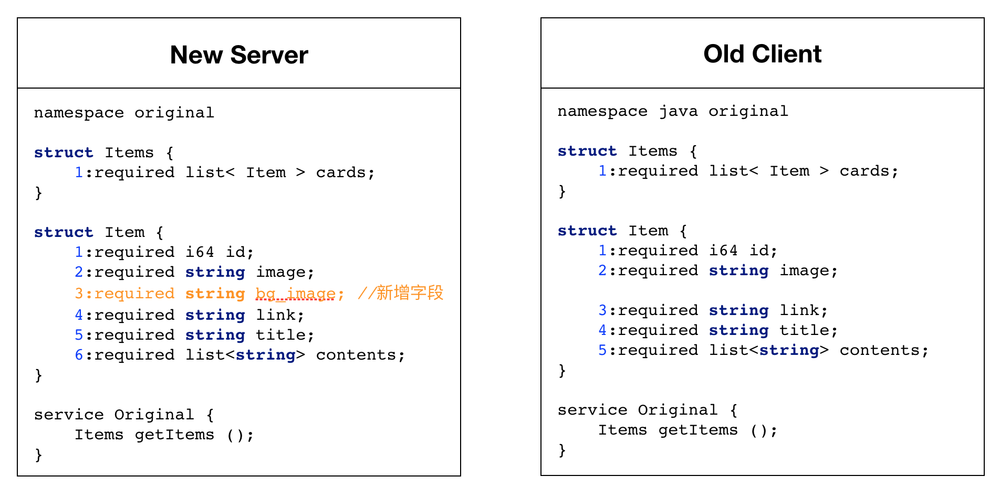
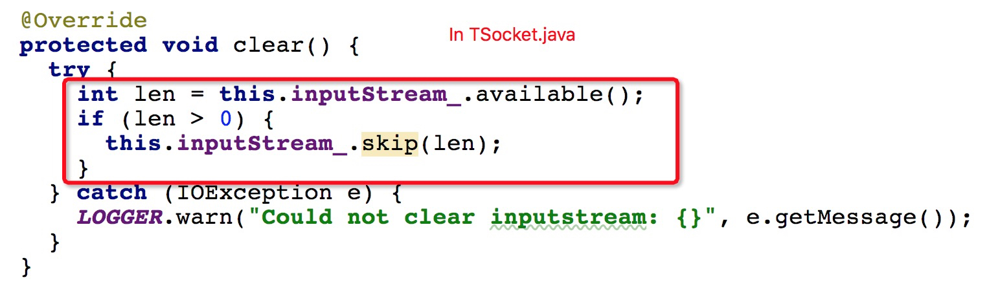

Thrift OOM
=============

A serious issue occured in prod env and finally it came out to be the changement of some fields in an IDL file, one of the clients was still using an older version and crashed due to OOM.

Senario os this issue could be stated as：“Return value of the interface is a list, element of which is a struct object and has 5 fields. A new field is added to the middle of the struct”, as shown in the image below.


Even if there's a mismatch between old client and new server, the worst condition we could imagine is to just print errors, crash of the client is absolutely not bearable. 

To reproduce OOM issue
============

This issue could be reproduced with a shorter IDL, as shown below:
```
namespace java com.didiglobal.thrift.sample1.samplenew
 
 struct Items{
      1:required i64 id;
      2:required list<Item> items;
 }
 struct Item {
     1:required string name;
     2:required string image;
     3:required list<string> contents;
 }
 service Sample {
     Items getItems(1:i64 id);
 }
```

You could work it out yourself by downloading this project and run test case: OldClientNewServerTest.oldclient_should_oom_at_concurrency_10
In this case we use TSocket and TBinaryProtocol with thrift 0.11.0, a concurrency of 100 or even 10 could cause OOM.


Why there's an OOM issue
============
As we know Thrift tries to consume all data in inputstream by skipping fields that are redundant or have a type mismatch. At the same time Thrift validates every struct object and throws an exception if it's invalid.
It conflicts because Thrift won't consume subsequent fields if there's an exception.  

The current Thrift RPC request fails on such an exception, just as expected, but nothing is done to the underlying inputstream, which means there still exists some redundant data, and cursor points to some middle position of the inputstream.

Trouble comes to the next request who reuses this connection: After receiving responses, Thrift starts to read data hoping they are fresh data from server side, but actually they are redundant ones from a previous request. 
If you are familiar with Thrift deserialization you know that it always starts with a readI32() method, which means the length of the method's name. Unbelievable the length could be as large as **184549632**, which is about **176M**, that's why OOM occurs at a concurrency of **10**.


Why it's 184549632(176M)?
============
The way Thrift deserializes is exactly like a stack, as shown in the image below:


But if an exception is thrown, everything is different as we said before, cursor in inputstream now points to a middle position, so what kind a value will read from the always first method readI32()?
Take some time to think about out IDL file, it will read the next Item element if there isn't any exceptions, so the first four bytes should be:
```
byte type = TType.STRING; // byte 0：type of element Item's name field, which is TType.String with a value of 11
short id = 1;             // byte 1 and 2：seq of element Item's name field with a value of 1
int size = 7;             // byte 3：first byte of size of element Item's name field Item with a value of 6
```
We write a simple program to verify that these four bytes have an exact value of 184549632:


There's both a certainty and uncerntainty for the number of 184549632, it would be different if the next field is not a String or have a different seq id.

Another IDL file 'sample2' will allocate a byte array of 83888648, which is about 8M, and no OOM happens.


Lucky enough? No, the client side will read 8388864 bytes of data from inputstream, so it's waiting and waiting and the connection is blocked.

How to fix it
============
If there's a mismatch of IDL files between clients and server, we prefer the way to print errors instead of OOM.

There are several methods to do this but the method below should be a simple and elegant one:

1. Provide a safeClear() method with the default behavior to do nothing in TTransport
2. Clear inputstream in TSocket, and change a little in several other classes.
3. Call safeClear() in TServiceClient




I did a load test on my Macbook Air, which has 100 concurrencies and last 15 minutes with a total request number of 160 millions and an average data size of 0.5K, both client and server sides work fine.

Is strictread mode a workarounds?
============
Thrift provides a variety of configurations. Dive into Thrift's source code and it looks like using strictRead is a simple method to avoid OOM:

And this is how to use strictRead：
```
// In most cases people don't specifiy strictRead, which has a default value of false
TProtocol protocol = new TBinaryProtocol(transport);
// Speicify strictRead mode in TBinaryProtocol
TProtocol protocol = new TBinaryProtocol(transport, true, true);
// Speicify strictRead mode in TBinaryProtocol.Factory
TBinaryProtocol.Factory protFactory = new TBinaryProtocol.Factory(true, true);
```
A quick test shows that it won't OOM, but it deserves a load test? Lots of SocketException(Broken pipe) would happen after 5 minutes with a concurency of 100, and even that the client seems to be down.

Reason is that strictRead mode avoids to create a large size of byte array, but it still don't clear any data and will finally crash as there'a more and more repsonses from server side without being consumed.

Is TFramedTransport a workarounds?
============

TFramedTransport use buffers for a whole frame of data and theoreticlaly it will not block any data from server side。But a load test shows that using TFramedTransport will also OOM at a low concurrency.

Reason is that although TFramedTransport reads all data from underlying TSocket, it does not clear data in the readBuffer at a validate exception, which finally leads to a crash of OOM.

You could run this test case to verify yourself: OldClientNewServerTest.oldclient_should_oom_if_use_TFramedTransport_at_concurrency_10.

Fortunately TFramedTransport provides a clear() method, and if it's called after each request, OOM will not happen.

A summary
============

1. If fields are added or removed and client has a mismatch version with server, there would be unexpected consequences: misalignment of fields、connections being blocked, or even OOM.   

2. This bug exists in a chain of thrift versions from 0.8(or maybe earlier) up to the latest 0.13.0-snapshot

4. No quick workarounds available：strictRead mode or restrictStringLength does not work; TFramedTransport does work either unless manually call clear() method to clear readBuff. 

5. The proposed method：Thrift itself makes sure to clean redundant data in TSocket's inputstream or TFramedTransport's buffread after each request, a load test of 100 concurrencies has proven it

6. The best way ever is to remember: client and server always use the same version of IDL files
